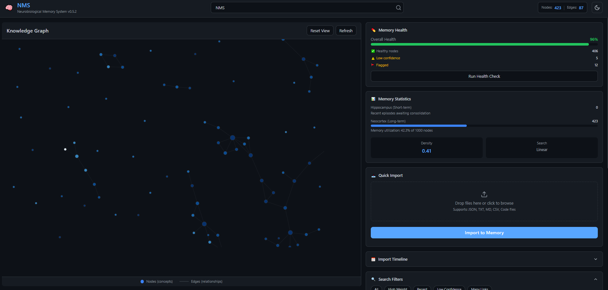
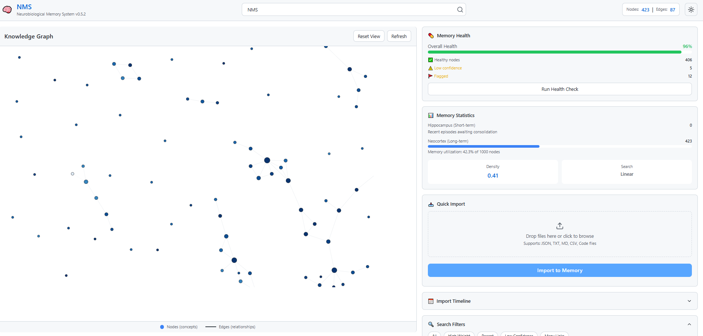
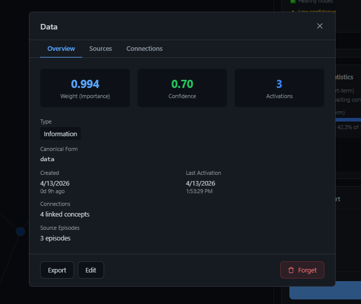

# 🧠 OpenClaw NMS (Neurobiological Memory System)

**Neurobiological AI Memory System**
**Version:** 0.5.2
**Date:** 2026-04-13
**Status:** ✅ Production Ready

[](https://opensource.org/licenses/MIT)
[](https://nodejs.org/)

---

## 📖 Description

A long-term memory system for AI that works like the human brain. Implements:
- **Synaptic Plasticity** (Hebbian learning)
- **Hippocampal-Neocortical Consolidation** (like in the brain)
- **Temporal Decay** (Ebbinghaus forgetting curve)
- **Meta-Learning** (system learns to optimize itself)
- **Procedural Memory** (action patterns and preferences)

---

## 📸 Screenshots

### Dashboard - Dark Theme


### Dashboard - Light Theme


### Node Explorer


---

## 🎨 What's New

### v0.5.2 - Modern Dashboard UI (April 2026) 🎨

**Completely redesigned web interface with modern design!**

- 🎨 **Modern UI** - Tailwind CSS, responsive design, 60/40 layout
- 🌓 **Dark/Light Themes** - theme switching with CSS variables
- 📊 **Health Dashboard** - real-time memory quality monitoring (health score, issues detection)
- 📅 **Import Timeline** - visual history of all imports with metrics
- 🔍 **Smart Search** - fast search with filters and intelligent scoring
- 👁️ **Node Explorer** - detailed node viewing in modal window
  - Overview tab: type, weight, confidence, flags
  - Sources tab: source episodes
  - Connections tab: relationships with other nodes
- 📂 **Drag & Drop Import** - file upload via drag and drop
- 📊 **Progress Tracking** - batch operation visualization
- 🗑️ **Forget Function** - safe node deletion with confirmation
- ⚡ **Enhanced Statistics** - real-time metrics updates

**New API Endpoints:**
- `GET /api/health` - memory health status
- `POST /api/health/check-quality` - node quality check
- `POST /api/health/check-contradictions` - contradiction detection
- `POST /api/health/fix-orphaned` - fix orphaned links
- `GET /api/import/history` - import history
- `DELETE /api/nodes/:nodeId` - delete node

**Dashboard Features:**
- Real-time graph visualization with D3.js
- Health monitoring with color indicators
- Top 15 concepts ranking
- Multi-file batch import with progress bar
- Search with filters (All, High Weight, Recent, Low Confidence, Many Links)

---

### v0.4.2 - Import System & Complete Documentation 📥

**Import external data easily!**

- 📥 **Import Manager** - load chats (ChatGPT, Claude, Gemini), documentation, code, CSV
- 🖥️ **Dashboard UI** - web interface for import (drag & drop), graph visualization
- 📚 **Complete Docs** - Getting Started, Import Guide, API Reference, Troubleshooting
- 🔒 **Security Audit** - .env.example, .gitignore, SECURITY.md, API key protection
- ⚙️ **Interactive Setup** - scripts/setup.js for quick installation

**Supported Formats:**
- **JSON** - ChatGPT/Claude/Gemini exports, generic chat format
- **Text** - Markdown (.md), plain text (.txt) with smart chunking
- **CSV** - structured data (concepts, facts)
- **Code** - JavaScript, Python, TypeScript (docstrings, comments)

### v0.4.0 - HNSW Vector Search 🚀

**100-1000x search acceleration** for graphs >1000 nodes!

- ⚡ **HNSW Search** - approximate nearest neighbor (ANN) algorithm for fast search
- 📊 **Smart Mode** - linear <1000 nodes, HNSW >1000 nodes (manual activation)
- 🎛️ **CLI Management** - info, enable-hnsw, disable-hnsw, rebuild-hnsw, benchmark
- 🔧 **Configuration** - search-config.json for parameter management
- 📈 **Performance** - 1000 nodes: 2s → 0.01s (200x faster!)

### v0.3.3 - Previous Features

- 📓 **Obsidian Export** - export knowledge graph to Obsidian-compatible Markdown
- 🔍 **Contradiction Detector** - automatic detection of contradictions in facts
- 🔍 **Semantic Search** - meaning understanding through embeddings (v0.3.0)
- 🔒 **Transactions** - ACID guarantees and data loss protection (v0.3.0)
- ⚡ **Fast Consolidation** - memory available in 5 minutes instead of 24 hours (v0.3.0)

---

## 🏗️ Architecture

```
📊 4-LAYER SYSTEM:

┌─────────────────────────────────────────┐
│ 1. SENSORY BUFFER                       │
│    All session events → 100% capture    │
│    Lifetime: 1 session                  │
└─────────────────────────────────────────┘
              ↓ encoding
┌─────────────────────────────────────────┐
│ 2. HIPPOCAMPUS                           │
│    Episodic memories                     │
│    Indexed by dates, fast search        │
│    Lifetime: until consolidation        │
└─────────────────────────────────────────┘
              ↓ consolidation (nightly)
┌─────────────────────────────────────────┐
│ 3. NEOCORTEX                             │
│    Semantic knowledge graph              │
│    Nodes + edges + weights (Hebbian)    │
│    Lifetime: ~30 days (decay)           │
└─────────────────────────────────────────┘
              ↓ implicit learning
┌─────────────────────────────────────────┐
│ 4. PROCEDURAL MEMORY                     │
│    Action patterns, preferences          │
│    Lifetime: permanent                   │
└─────────────────────────────────────────┘
```

---

## 📁 File Structure

```
~/.openclaw/memory/
├── hippocampus/
│   ├── sessions/               # Episodes by sessions
│   │   └── {sessionId}.json
│   ├── backups/                # Transaction backups (v0.3.0)
│   ├── daily-index.json        # Date index
│   └── synaptic-candidates.json # Consolidation candidates
│
├── neocortex/
│   ├── knowledge-graph.json    # Semantic graph (nodes + edges)
│   ├── learning-params.json    # Hebbian parameters
│   └── search-config.json      # HNSW configuration (v0.4.0)
│
├── meta/
│   ├── consolidation-history.json # Consolidation logs
│   └── import-history.json        # Import logs (v0.4.2)
│
├── procedural/
│   ├── action-patterns.json    # Action patterns
│   └── preferences.json        # User preferences
│
├── data/
│   └── embedding-cache.json    # Embedding cache (v0.3.0)
│
└── dashboard/                  # Web UI (v0.5.2)
    ├── index.html
    ├── dashboard.js
    └── server.js
```

---

## 🚀 Quick Start

### 1. Installation

```bash
# Clone repository
git clone https://github.com/botrozovsky-droid/NMS.git
cd NMS

# Install dependencies
npm install

# Interactive setup
npm run setup
```

### 2. Configuration

Create `.env` file:

```bash
# Copy template
cp .env.example .env

# Add your Gemini API key
GEMINI_API_KEY=your_api_key_here
```

Get API key: https://makersuite.google.com/app/apikey

### 3. Launch Dashboard

```bash
npm run dashboard
```

Open: http://localhost:3000

---

## ✨ Core Features

### 🧠 Hebbian Learning

**"Neurons that fire together, wire together"**

- Connections strengthen with repetition
- Weights increase through reinforcement
- Natural forgetting via temporal decay

### 🔄 Consolidation

**Hippocampus → Neocortex (like sleep)**

- Automatic nightly consolidation
- Fast mini-consolidation after sessions
- Gemini API analyzes patterns and creates connections
- Extracts concepts and relationships

### 📊 HNSW Vector Search

**Fast semantic search**

- 100-1000x acceleration for large graphs
- Approximate Nearest Neighbor (ANN)
- Automatic activation for >1000 nodes
- Configurable parameters (M, efConstruction, efSearch)

### 🔒 Transaction Safety

**ACID guarantees**

- Automatic backups before changes
- Rollback on errors
- Data integrity protection
- Transaction history

### 📥 Import Manager

**Load external data**

Supported formats:
- JSON (ChatGPT, Claude, Gemini exports)
- Text (Markdown, plain text)
- CSV (structured data)
- Code (JS, TS, PY with docstrings)

### 🖥️ Web Dashboard

**Beautiful visualization**

- Interactive knowledge graph (D3.js)
- Health monitoring
- Search with filters
- Node explorer
- Import timeline
- Dark/light themes
- Drag & drop import

---

## 📖 API Reference

### Memory Manager

```javascript
import memoryManager from './memory-manager.js';

// Store episode
await memoryManager.store({
  type: 'conversation',
  content: 'User asked about Hebbian learning',
  tags: ['learning', 'neuroscience'],
  importance: 0.8
});

// Search
const results = await memoryManager.query('Hebbian learning', {
  limit: 5,
  minRelevance: 0.6
});

// Recall by session
const memories = await memoryManager.recall({
  sessionId: 'session-123',
  limit: 10
});

// Delete node
await memoryManager.deleteNode('node-id');
```

### Dashboard API

```bash
# Health status
GET /api/health

# Node search
POST /api/search
{
  "query": "learning",
  "limit": 10
}

# Delete node
DELETE /api/nodes/:nodeId

# Import file
POST /api/import/file
Content-Type: multipart/form-data

# Import history
GET /api/import/history
```

---

## 🧪 Testing

```bash
# Run all tests
npm test

# Specific test suites
npm run test:v02           # v0.2 features
npm run test:v03:semantic  # Semantic search
npm run test:v03:transactions  # Transactions
npm run test:v03:sessions  # Session consolidation
npm run test:v03:export    # Obsidian export

# Search benchmarks
npm run search:benchmark
```

**Test Results:** 36/36 tests passing ✅

---

## 📚 Documentation

- [Getting Started](docs/GETTING-STARTED.md) - Installation and basic usage
- [Import Guide](docs/IMPORT-GUIDE.md) - How to import external data
- [API Reference](docs/API-REFERENCE.md) - Complete API documentation
- [Troubleshooting](docs/TROUBLESHOOTING.md) - Common issues and solutions

---

## 🛠️ CLI Commands

```bash
# Consolidation
npm run consolidate          # Run nightly consolidation
npm run meta-learn           # Meta-learning optimization

# Search management
npm run search:info          # HNSW status
npm run search:enable-hnsw   # Enable HNSW
npm run search:disable-hnsw  # Disable HNSW
npm run search:rebuild-hnsw  # Rebuild index
npm run search:benchmark     # Performance benchmark

# Quality checks
npm run check-quality        # Detect low-confidence nodes
npm run fix-quality          # Auto-fix quality issues
npm run check:contradictions # Find contradictions
npm run fix:contradictions   # Resolve contradictions
npm run fix:orphaned-links   # Fix orphaned links

# Import
npm run import:file <path>   # Import single file
npm run import:dir <path>    # Import directory
npm run import:batch <glob>  # Batch import
npm run import:history       # Show import history

# Export
npm run export:obsidian      # Export to Obsidian vault

# Statistics
npm run stats                # Show memory stats
npm run tx-stats             # Transaction statistics
npm run session-stats        # Session statistics
```

---

## 🔧 Configuration

### Hebbian Parameters

Edit `neocortex/learning-params.json`:

```json
{
  "hebbian": {
    "learningRate": 0.1,
    "decayRate": 0.01,
    "threshold": 0.3,
    "maxWeight": 1.0
  },
  "consolidation": {
    "batchSize": 20,
    "minImportance": 0.5,
    "maxAge": 7
  }
}
```

### HNSW Search

Edit `neocortex/search-config.json`:

```json
{
  "mode": "hnsw",
  "hnsw": {
    "M": 16,
    "efConstruction": 200,
    "efSearch": 100
  },
  "autoActivate": {
    "enabled": true,
    "threshold": 1000
  }
}
```

---

## 🤝 Contributing

Contributions are welcome! Please:

1. Fork the repository
2. Create a feature branch (`git checkout -b feature/amazing-feature`)
3. Commit your changes (`git commit -m 'Add amazing feature'`)
4. Push to the branch (`git push origin feature/amazing-feature`)
5. Open a Pull Request

---

## 📄 License

MIT License - see [LICENSE](LICENSE) file for details

---

## 🙏 Acknowledgments

- Inspired by neuroscience research on memory consolidation
- Based on Hebbian learning principles
- Uses [HNSW algorithm](https://github.com/nmslib/hnswlib) for vector search
- Built with [Gemini API](https://ai.google.dev/) for pattern analysis

---

## 📧 Contact

- GitHub: [@botrozovsky-droid](https://github.com/botrozovsky-droid)
- Repository: [NMS](https://github.com/botrozovsky-droid/NMS)

---

**⭐ If you find this project useful, please give it a star!**
